# Advanced Data Mining and Machine Learning

- **Accademic year:** 2019/20
- **CdS:** Artificial Intelligence and Data Engineering
- **Student:** Matilde Mazzini
- **Project Name:** VideoGames Genre Prediction

## Table of contents
1) [Introduction](#1-introduction)
2) [Multi-label or Multi-class?](#2-multi-label-or-multi-class)
3) [Data Collection](#3-data-collection)
4) [Data Preprocessing](#4-data-preprocessing)
5) [Data Mining](#5-data-mining)
6) [Naive Bayes Multinomial Text](#6-naive-bayes-multinomial-text)
7) [Random Forest](#7-random-forest)
8) [SMO](#8-smo)
9) [Application](#9-application)
10) [Implementation](#10-implementation)


## 1 Introduction

Websites like Rawg and Steam offer huge databases of videogames description to allow the users to browse and read about their favourite games.
They also offer the possibility to browse these games info pages per genre, to help users selecting the game of interest based on the genre. The genre tagging process is complex and time consuming. If Ican automatize this process of game tagging, it will be fast, save human effort and it will be more accurate than an untrained human.

Through the Rawg API its website had been scraped to collect the data. Text analysis was performed on the collected videogames descriptions, and then the classifiers were trained using text analysis techniques.

GIAR (Games information and Ratings) is an existing application that collects information and ratings about videogames. An admin can insert a new game in the GIAR database accessig the Insert New Game page. During this process the admin should specify many information about the game like: name, release date, description, genre and many more.

The idea of this project is to add a genre prediction feature to the existing GIAR application to make the process of inserting a new game faster. 

After the admin loads a description of a game on the `Insert a new game page`, the application offers the possibility to predic the multiple genres to which a game belongs and proposes the result in a list that the admin can modify. 

## 2 Multi-label or Multi-class?
Because of the fact that a game can be (and often so) associated with **more than one** genres, this is not a multi-class classification problem, where there’s only one label per observation, but it is a multi-label classification problem, where multiple labels may be assigned to each instance.

### Multi-class models
- Many class values c={c1,c2,...ck}
- An object may belong to only **one** class. Oj -> Cj

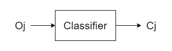

A standard k-fold cross validation may be used to evaluate this classifier, because one object may belong to only one class and the confusion matrix it is easy to construct.

### Multi-label models
- Many class values c={c1,c2,...ck}
- An object may belong to **multiple** class. Oj -> (Cj,Cp,Cq)

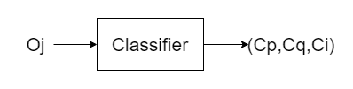

Most of the classifiers we studied work like multi-class classifiers: they assign one class to each object. A classifier that assign multiple class to a single object is needed. 
This will be implemented like this:
- Creating a 2-class classifier per each class like binary classifiers do (recognize one class, discard others).
- Use those models in parallel.

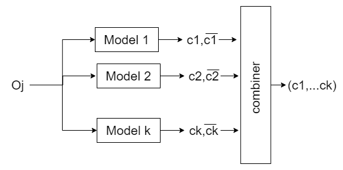

#### Evaluation
Since an object may belong to multiple classes, to evaluate the correctness of the classification the overall result must be taken into consideration. a normal confusion matrix can't be build for such problem because it map the relation between predicted and real class of an object that belongs to a single class.
A special confusion matrix must be constructed.

## 3 Data Collection 

The Data set was retrieved from Rawg, an online video games database. The documents of almost 80,000 games were scraped with the Rawg API. For this project about **50,000**  titles in which both the description and genre information were available were selected.

There are 19 listed genres in the data set and only the **12**  most commong genres were used in this project. The genres names and percentages of games in them are: 

Genre | Count | Percentage
------------ | ------------- | -------------
Action | 20322 | 26 %
Adventure | 15707 | 20 %
RPG | 7493 |  10 %
Simulation | 7943 |10 %
Strategy | 7263 | 9 %
Puzzle | 7145 | 9 %
Shooter | 3561 | 5 %
Sports | 2665 | 3 %
Racing | 2475 | 3 %
BoardGames | 1484 | 2 %
Fighting | 899 | 1 %
Educational | 857 |  1 %

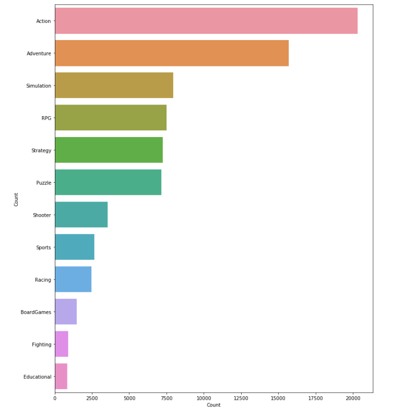

## 4 Data Preprocessing

The very first data set cleaning step was to retrieve from the overall database only the name, the description and the list of genres for every game. 

name |description | genres
---|----|--------
007 legends|Gamers and Bond aficionados alike will become James Bond, reliving the world-famous spy’s most iconic and intense undercover missions from throughout the entire Bond film franchise — including this year’s highly anticipated new installment, “SKYFALL” available as a free download on November 9, 2012.|['Action', 'Shooter']

Then the records in which the genres list or the description were empty were removed.

Numbers, commas and links were removed from the text of the description. 

Records of games not written in english were removed.

Words made by only two letters where removed from the descriptions.


After this first cleaning process of the initial database, a new csv was created with a script in python. The new structure of the database is created in order to substitute the list of genres a description with a vector of 0 and 1 , such that the 1 corresponding to the multiple genres that a game can assume. Like this:

descr | Puzzle | Adventure | Action | RPG | Simulation | Strategy | Shooter | Sports | Racing | Educational | Fighting |BoardGames
---|----|--------|-|-|-|-|-|-|-|-|-|-|
gamer bond aficionado alik becom jame bond reliv world famous spi icon intens undercov mission throughout entir bond film franchis includ year high anticip new instal skyfal avail free download novemb | 0 | 0| 1| 0| 0| 0| 1| 0| 0|0|0|0

The final dataset that was imported in Java is balanced: it has been created inserting around 300 items for each genre randomly taken from the cleaned dataset paying attention to not insert the same description multiple times.


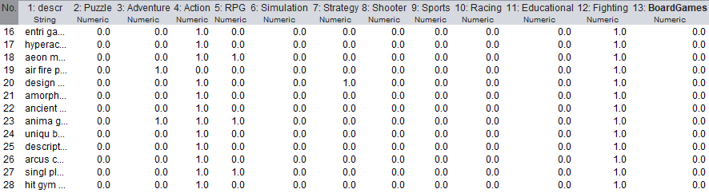

Dimension of dataset: 2103 instances.


## 5 Data Mining

All the following operations were made in Java using the Weka API.

#### Training

The input balanced dataset is randomized, the items are shuffled.

The overall dataset is divided in 10 fold of equal size to perform the cross validation.

For every fold a new training and test sets were defined:

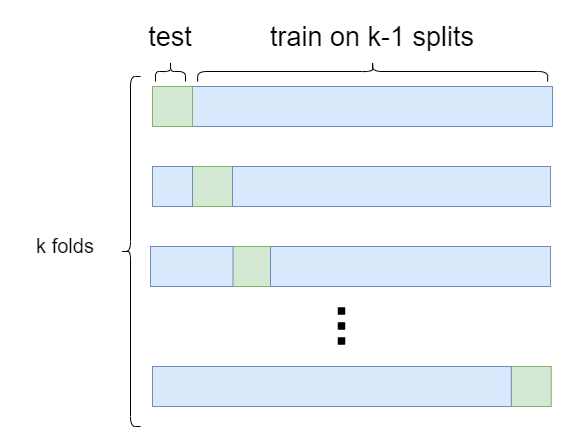

For each of theese training and test sets combination the following is executed:

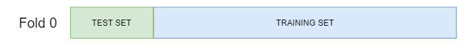

Starting from the current training set, 12 binary balanced datasets, one for each genre, are created like this: select the same number of istances classified with at least that genre and same number of istances classified with genres different from the actual one.

With theese binary datasets the 12 binary classifiers were trained to classify an item as of that specific genre or not. 

Training schema:
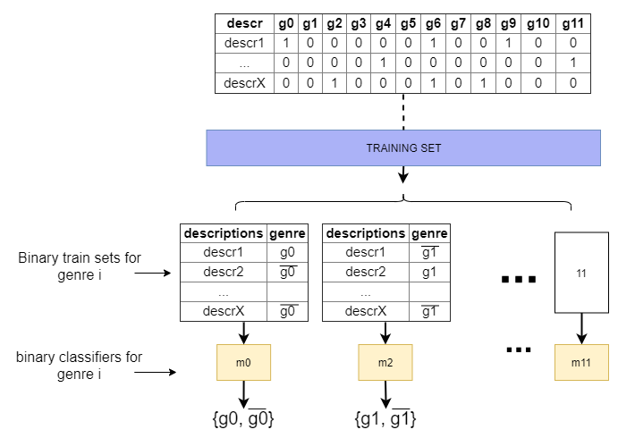

#### Test

Every single instance of the test set was processed in parallel from each classifier and all the results stored in 12 confusion matrix, one per each classifier.

The classes of the single test instance were set missing in order to give it in input to all the 12 classifiers and compare the results with the labeled instance of the test set.

Every output of a classifier, after an istance of the unlabeled testset was given as input, is compared to the actual corresponding class of the real test set, and the confusion matrix updated adding +1 in the cell corresponding to the predicted column and the expected row.
Every time a classifier of a specific genre is tested the corresponding row of the correspondig confusion matrix is updated.

The classifiers are trained at every fold with different test and train set.

Test:

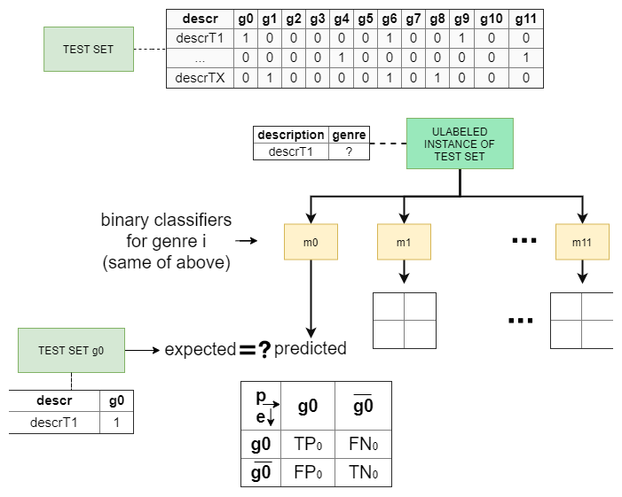 

#### Evaluate the model

For each label j the metrics were computed from each confusion matrix and then aggregated with the average formula.

General formulas:

Precision  =  𝑇𝑃/(𝑇𝑃+𝐹𝑃)

Recall = 𝑇𝑃/(𝑇𝑃+𝐹𝑁)

Accuracy = (𝑇𝑃+𝑇𝑁)/(𝑇𝑃+𝐹𝑃+𝑇𝑁+𝐹𝑁)

Fmeasure =  (2×𝑝𝑟𝑒𝑐𝑖𝑠𝑖𝑜𝑛×𝑟𝑒𝑐𝑎𝑙𝑙)/(𝑝𝑟𝑒𝑐𝑖𝑠𝑖𝑜𝑛+𝑟𝑒𝑐𝑎𝑙𝑙)

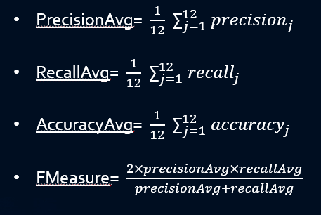 


## 6 Naive Bayes Multinomial Text

Precision | Recall | Accuracy | Fmeasure 
---|----|--------|-
0.265 | 0.788 | 0.756  |0.397

## 7 Random Forest
Precision | Recall | Accuracy | Fmeasure 
---|----|--------|-
0.224 | 0.744 | 0.706  |0.345

## 8 SMO
Precision | Recall | Accuracy | Fmeasure 
---|----|--------|-
0.208 | 0.702 | 0.699  |0.321


## 9 Application
In the Admin Interface:

Inside the `Insert New Game` page the admin can insert different information regarding the game. After the description loading, he can press the Predict button to see the list of the predicted genres for that game. He can then add or remove genres from the list in case of unprecise predictions.

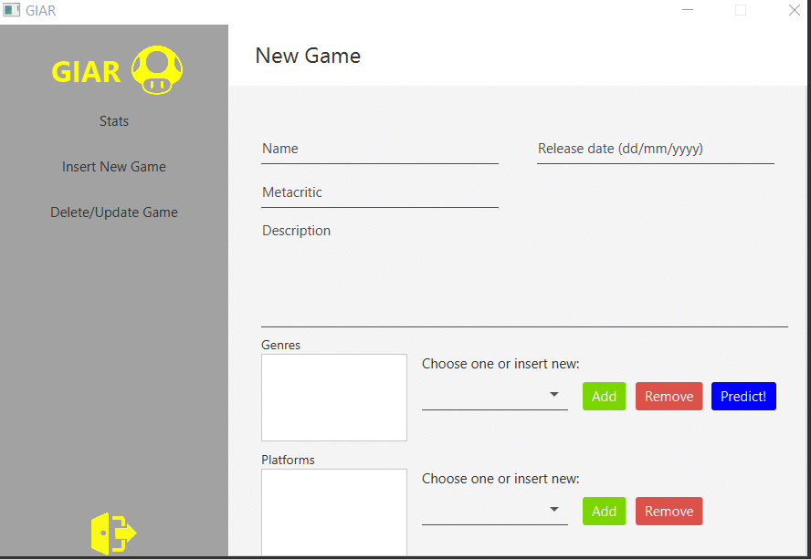


## 10 Implementation

### CROSS-Validation

```java
	public static void createDatasets( List<String> genres){

			// Reading Entire Dataset
			DataSource source;
			try {
				source = new DataSource("src/main/resources/finaldataset.arff");
				Instances data = source.getDataSet();			
				
				// Randomize the dataset
				data.randomize(new Random(1)); 	

				for(int i=0; i<10; i++){ // To calculate the results in each fold
					
					Instances test = data.testCV(10, i);
					Instances train = data.trainCV(10, i);
 
					//TO CHECK
					vettTest[i]=test;
		
					int numInstancesTrain = train.size();		
					
					System.out.println("fold: "+ i + " " +train.size() + ":train" + "test: " + test.size());
					
					//CREATION OF 12 BINARY DATATSETS (repeats this for every fold)
					createBinaryDatasets( genres, numInstancesTrain, train, i, test);	
					testNaive(test,genres);
	
				}	
					
			} catch (Exception e) {
				// TODO Auto-generated catch block
				e.printStackTrace();
			}
	}
```

### Build 12 binary dataset, train classifiers

```java
	public static void createBinaryDatasets( List<String> genres,  int numInstances, Instances train, int foldnum, Instances test) {
		try {
			for(int z = 0; z < genres.size(); z++) {	//12 genres		
				
				ArrayList<Attribute> attributes = new ArrayList<Attribute>();
				attributes.add(new Attribute("description", true));
				ArrayList<String> labels = new ArrayList<String>();
				labels.add("0");
				labels.add("1");
				
				attributes.add(new Attribute(genres.get(z),labels));
				

				Instances binTrainDataset = new Instances("Try", attributes, 400);
				binTrainDataset.setClassIndex(binTrainDataset.numAttributes() - 1);

				// adding instances		
				int class_count = 0;

				//insert the rows with genre!=other
				for ( int j = 0; j < numInstances; j++ ){			
					if(class_count<200) {
						double[] val = new double[2];
						val[0] = binTrainDataset.attribute(0).addStringValue(train.instance(j).stringValue(0));	//val0 takes descr
						
						if(train.instance(j).value(z+1) == 1) {		
							val[1] = 1; 	//val1 takes 1 
							
							binTrainDataset.add(new DenseInstance(1.0, val));
							class_count++;
				
						}	
					}
				}
				
				//insert the rows with genre=other
				for ( int j = 0; j < numInstances; j++ ){	//for each row of the dataset				
					double[] val = new double[2];
					val[0] = binTrainDataset.attribute(0).addStringValue(train.instance(j).stringValue(0));

					if(!(train.instance(j).value(z+1) == 1)) {	
						if(class_count > 0) {
							val[1] = 0;
							binTrainDataset.add(new DenseInstance(1.0, val));
							class_count--;
						}
					}
					
					if(class_count == 0) {
						break;
					}			
				}
				
				vettTrain[foldnum][z] = binTrainDataset;	//save the db in the dbarray at genre z position	

				// train the classifier for this binary
				String[] options = weka.core.Utils.splitOptions("-W -P 0 -M 2.0 -norm 1.0 -lnorm 2.0 -lowercase -stopwords-handler weka.core.stopwords.Rainbow -tokenizer weka.core.tokenizers.AlphabeticTokenizer -stemmer \"weka.core.stemmers.SnowballStemmer -S porter\"");		
				vettNaive[z]= new NaiveBayesMultinomialText();
				vettNaive[z].setOptions(options);
				vettNaive[z].buildClassifier(binTrainDataset);
				
				
			}
		} catch (Exception e) {
			// TODO Auto-generated catch block
			e.printStackTrace();

		}

	}
```

### Test

```java

	public static void testNaive(Instances test, List<String> genres ) {
		try {
			for (int i = 0; i < test.numInstances();i++){		//for every test set tuple
				
				for(int z = 0; z < genres.size(); z++) {	//for each classifier
					
					//build dataset with a single instance
					ArrayList<Attribute> attributes = new ArrayList<Attribute>();
					ArrayList<String> labels = new ArrayList<String>();
					labels.add("0");
					labels.add("1");
					attributes.add(new Attribute("description", true));
					attributes.add(new Attribute(genres.get(z),labels));
				
					Instances unlabeled = new Instances("Try", attributes, 1);	//1 num instances
					unlabeled.setClassIndex(unlabeled.numAttributes() - 1);
					// adding instances			
					double[] val = new double[2];
					val[0] = unlabeled.attribute(0).addStringValue(test.instance(i).stringValue(0)); //val0 take the description
					val[1] = 0;	//doesnt matter, will be missing

					unlabeled.add(new DenseInstance(1.0, val));
					unlabeled.instance(0).setClassMissing(); 
					
					//classify the instance with the classifier z. put the result in p
					int predicted;
					int expected;
					if(vettNaive[z].classifyInstance(unlabeled.instance(0)) == 1)
						predicted = 1;
					else
						predicted = 0;
					
					// insert in E the expected class of the instace i of the genre attribute z+1
					expected = (int)test.instance(i).value(z+1);
	

					//compare P and e- make the controls and update the conf matrix z
					
					if (predicted==1 && expected ==1 ) {
						//tp
						confusionMatrix[z][0]++;
					}
					else if(predicted==0 && expected ==1 ) {
						//fn
						confusionMatrix[z][1]++;
					}
					else if(predicted==1 && expected ==0 ) {
						//fp
						confusionMatrix[z][2]++;
					}
					else if(predicted==0 && expected ==0 ) {
						//tn
						confusionMatrix[z][3]++;
					}
					
				
				}				
			}
	
		} catch (Exception e) {
			// TODO Auto-generated catch block
			e.printStackTrace();
		}	
}
```


### Evaluation of the model

```java
	
	public static void evaluate() {
		double[] precision= new double[12];
		double[] accuracy= new double[12];
		double[] recall = new double[12];
		double precisionavg,accuracyavg,recallavg,fmeasure,sum1=0,sum2=0,sum3=0;
		
		for(int i=0; i<12; i++) {
			double tp=confusionMatrix[i][0];
			double fn=confusionMatrix[i][1];
			double fp=confusionMatrix[i][2];
			double tn=confusionMatrix[i][3];
			
			precision[i]=tp/(tp+fp);
			
			recall[i]=tp/(tp+fn);
			
			accuracy[i]=(tp+tn)/(tp+fp+tn+fn);
			
			sum1 +=precision[i];
			sum2 +=recall[i];
			sum3 +=accuracy[i];
		}
		precisionavg=sum1/12;
		recallavg=sum2/12;
		accuracyavg=sum3/12;
		fmeasure=(2*precisionavg*recallavg)/(precisionavg+recallavg);

		System.out.println("matrices");
		printmatrices(confusionMatrix);
		System.out.println("precision:" + precisionavg);
		System.out.println("recall:" + recallavg);
		System.out.println("accuracy:" + accuracyavg);
		System.out.println("fmeasure:" + fmeasure);
	}
```


### Exporting the 12 models to be used in the genre prediction
```java
//export models
for(int z = 0; z < genres.size(); z++) {		
        SerializationHelper.write(new FileOutputStream("./src/main/resources/models/"+genres.get(z)+".model"), vettNaive[z]);	
}
```


### Genre Prediction

In the following code you can see that the description loaded by the admin is collected and used to build a dataset with only one unlabeled instace.
The dataset is given as input to the 12 classifiers, and everytime that a classifier of a specific genre gives a positive output, that genre is added to the list of predicted genres.

```java
	public static List<String> predictGenres(String descrizione) {
		List<String> predictedGenres = new ArrayList<String>();
		try {	
			//decription cleaning 	
			descrizione = descrizione.replaceAll("(https?http|ftp|file)://[-a-zA-Z0-9+&@#/%?=~_|!:,.;]*[-a-zA-Z0-9+&@#/%=~_|]", " ");
			descrizione = descrizione.replaceAll("\\s+", " ");

			//build dataset with just one istance
			ArrayList<Attribute> attributes = new ArrayList<Attribute>();
			ArrayList<String> labels = new ArrayList<String>();
			labels.add("other");

			attributes.add(new Attribute("description", true));
			attributes.add(new Attribute("genre", labels));

			Instances unlabeled = new Instances("Try", attributes, 1);	//1 num istances
			unlabeled.setClassIndex(unlabeled.numAttributes() - 1);
			// adding instances			
			double[] val = new double[2];
			val[0] = unlabeled.attribute(0).addStringValue(descrizione);
			val[1] = 0;
			
			unlabeled.add(new DenseInstance(1.0, val));
			unlabeled.instance(0).setClassMissing(); 

			//for every model predict
			for(int z = 0; z < genres.size(); z++) {
				NaiveBayesMultinomialText NBMT;

				NBMT = (NaiveBayesMultinomialText)SerializationHelper.read("./src/main/resources/models/"+ genres.get(z) + ".model");
				System.out.println();
				if(NBMT.classifyInstance(unlabeled.instance(0)) == 0) {
					String predgen = genres.get(z);
					predictedGenres.add(predgen);	        
				}	
			}

		} catch (Exception e) {
			e.printStackTrace();
		}

		return predictedGenres;
	}
```


